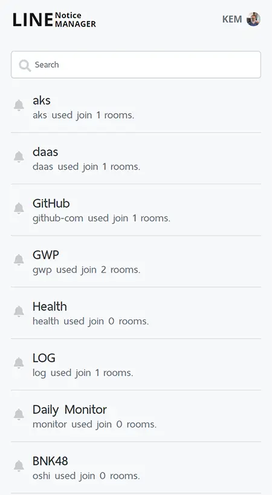
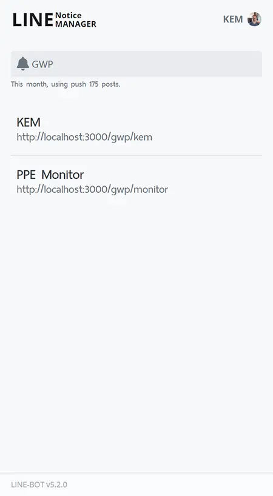
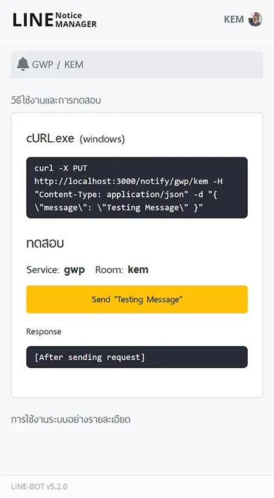

# LINE Notify API has been deprecated and set to sunset on March 31, 2025

## Notice-Manager Web GUI


This is a template to help you if you want to implement Line Notify. It help us follow:

- Authenication with Line Notify server
- Help you to access token from Line Notify server
- A notify entry point to notify Line Notify server

### Just want to try it?
- Build Container with UI and API
```bash
docker pull dvgamerr/notice:latest
docker run --rm -p 3000:3000 -v db-notice:/db -e SQLITE_PATH=/db/notice.db dvgamerr/notice:latest
```

#### Development
```bash
bun i
bun --watch index.js | pino-pretty
```

## UI Sample

| Notify                                   | Room                                 | Detail                                   |
| ---------------------------------------- | ------------------------------------ | ---------------------------------------- |
|  |  |  |
