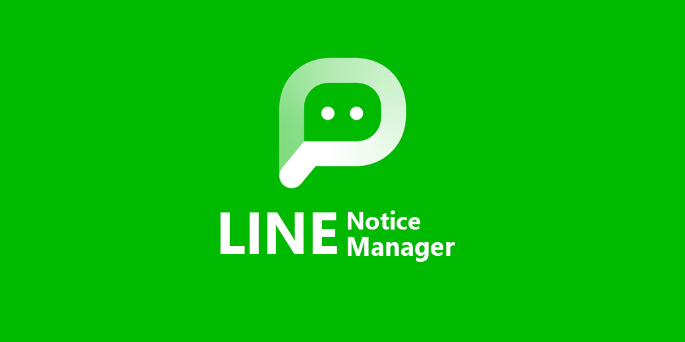
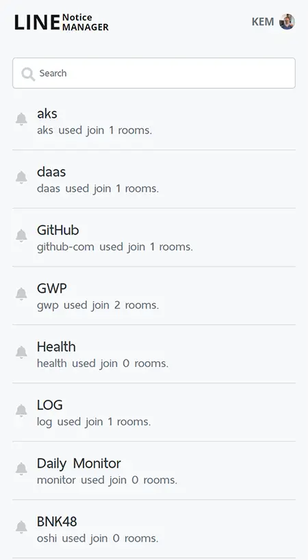
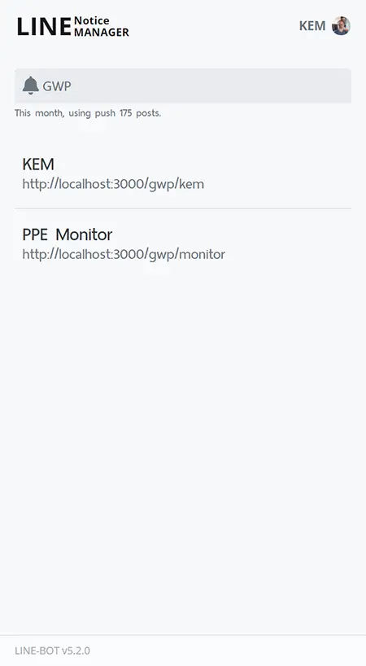
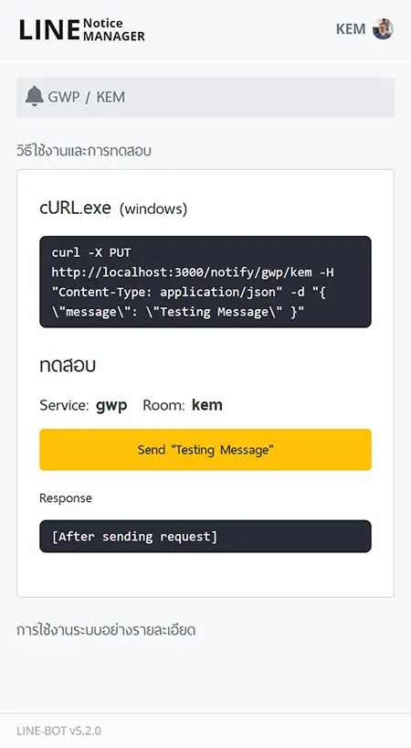

## Notice-Manager Web GUI

This is a template to help you if you want to implement Line Notify. It help us follow:

- Authenication with Line Notify server
- Help you to access token from Line Notify server
- A notify entry point to notify Line Notify server

### [Just want to try it?](https://notice.touno.io/)

## UI Sample

| Notify                                   | Room                                 | Detail                                   |
| ---------------------------------------- | ------------------------------------ | ---------------------------------------- |
|  |  |  |
