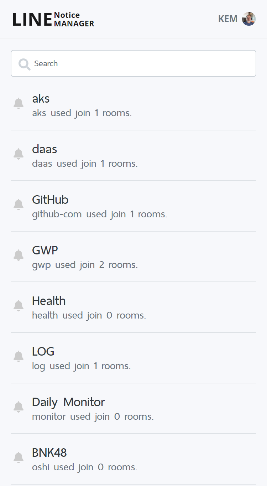
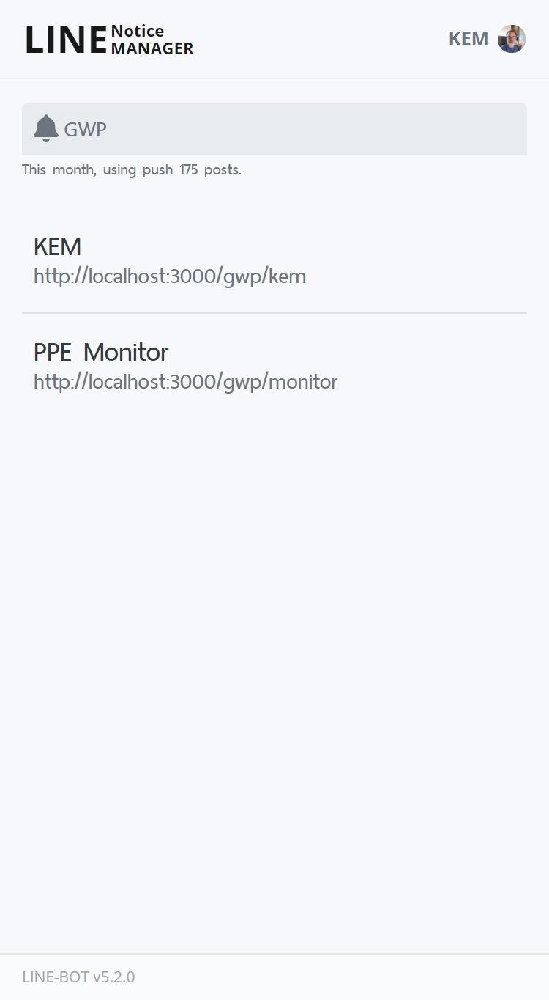
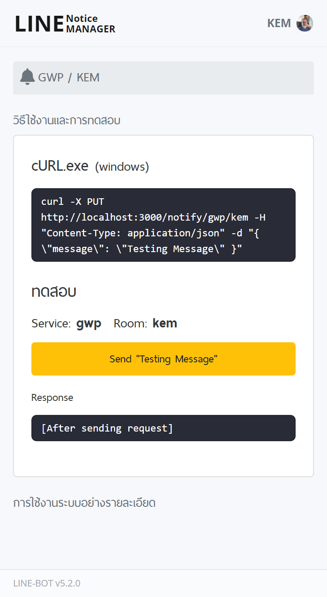
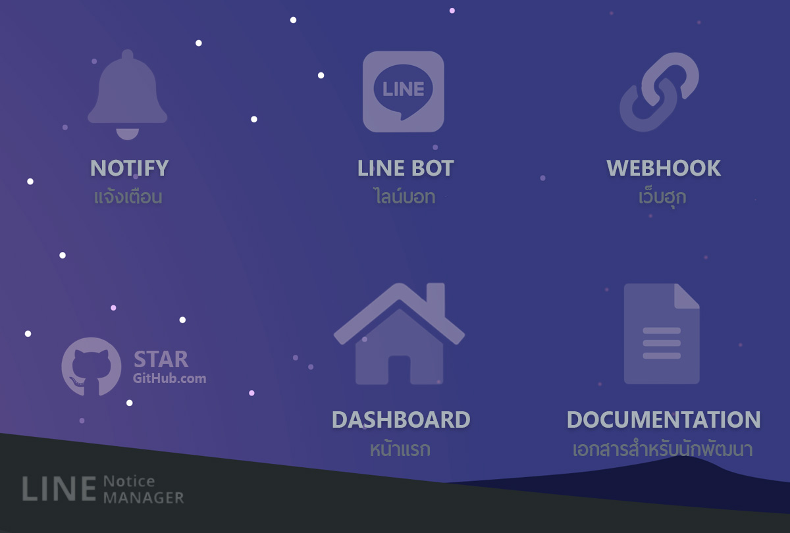

## LINE-BOT and LINE Notify Web GUI

สร้าง http api แบบง่ายๆ โดยใช้เพียง url webhook เท่านั้น

### Supported

- LINE Notify
- LINE BOT `feature`

### UI Sample

| Notify                                  | Room                                | Detail                                  |
| --------------------------------------- | ----------------------------------- | --------------------------------------- |
|  |  |  |

### Rich Menu

